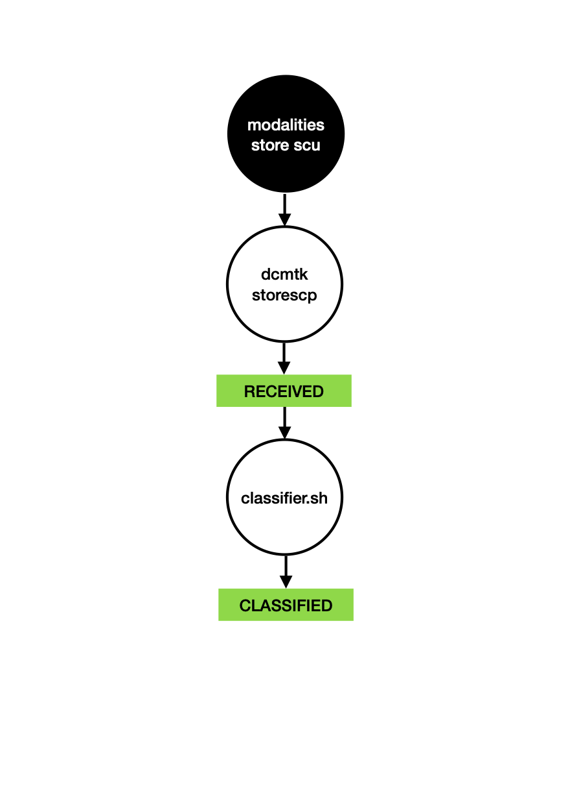

# storescp

storescp recibe los objetos por servicio STORE SCP como si fuese un PACS, pero les clasifica dentro de un directorio spool para su preprocesamiento.

La aplicación storescp se coloca dentro de la red imagenológica local y se configura como SCP (aet, ip, puerto) de destino de las operaciones DICOM STORE SCU realizadas por las modalidades de adquisición de imágenes médicas (CR, DX, CT, MR, etc). Usamos el utilitario STORE SCP de la caja de herramientas de código libre **dcmtk**, muy confiable y universal para recibir los objetos. dcmtk está configurado:
- con las opciones más liberales posibles (acepta todo lo que entra),
- elimina las indicaciones de tamaño de grupos
- reemplaza eventuales tamaños de sequencias y/o items por la sintaxis con markup de fin de serie y de fin de sequence.

## ARRIVED y CLASSIFIED

ARRIVED y CLASSIFIED están usados por dcmtk.

- dcmtk recibe un objeto, 
- dcmtk crea si necesario un subdirectorio de ARRIVED con el nombre StudyInstanceUID del estudio correspondiente, 
- dcmtk coloca dentro de esta subcarpeta el objeto identificado por su SOPInstanceUID,
- dcmtk invoca un script que mueve el objeto hacía un subsubdirectorio de CLASSIFIED.
  - el nombre del subdirectorio de CLASSIFIED esta formado por modality@aetDeOrigen@IPdeOrigen
  - el nombre del subsubdirectorio es el StudyInstanceUID
  - el nombre del objeto esta formado por el SOPInstanceUID_unixTime
      - unixTime es la cantidad de segundos desde 1970-01-01 00:00:00 y permite diferenciar dos copias distintas de una misma instancia.

