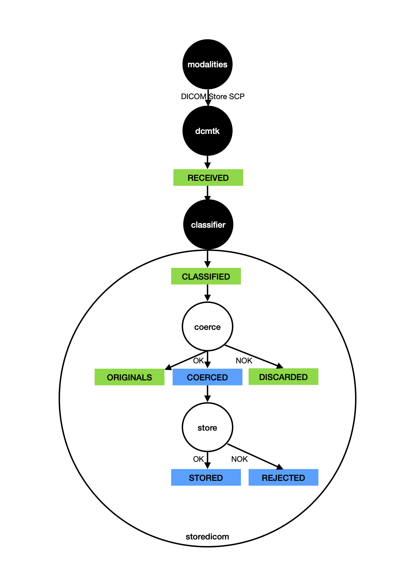

# storedicom

Storedicom permite la verificación y normalización de los objetos DICOM creados por las modalidades antes que entren en el repositorio definitivo, o sea el PACS.

Storedicom está disponible solo para PACS que soportan DICOMweb STORE (antes llamado stow), es decir la posibilidad de mandar varios objetos dicom por http post.

Funcionalidades de storedicom:
- agrupar objetos y mandarlos más allá de una red local insegura a un servidor remoto.
- comprimir las imágenes en jpeg 2000 sin pérdida antes de atravesar un enlace con ancho de banda limitado
- verificar previo al envio la identificación correcta (o compatible) del paciente con los objetos ya presentes en el pacs de destino
- uniformizar los nombres de instituciones
- ...

En una futura nueva versión, storedicom usará pipedicom para procesar las imágenes.

## Funcionamiento

Storedicom recibe los objetos por servicio STORE SCP como si fuese un PACS, pero les hace pasar por un pipeline de verificación y modificación y finalmente intenta enviarlos al PACS por protocolo STORE DICOMweb.

La aplicación storedicom se coloca dentro de la red imagenológica y se configura como SCP (aet, ip, puerto) de destino de las operaciones DICOM STORE SCU realizadas por las modalidades de adquisición de imágenes médicas (CR, DX, CT, MR, etc). Usamos el utilitario STORE SCP de la caja de herramientas de código libre **dcmtk**, muy confiable y universal para recibir los objetos. dcmtk está configurado:
- con las opciones más liberales posibles (acepta todo lo que entra),
- elimina las indicaciones de tamaño de grupos
- reemplaza eventuales tamaños de sequencias y/o items por la sintaxis con markup de fin de serie y de fin de sequence.

El pipeline de procesamiento de los objetos DICOM recibidos está materializado por una estructura de directorios, dentro de la cual los objetos están desplazados a medida que avanza su procesamiento.

El directorio raíz de esta estructura tiene por nombre el aet usado por dcmtk para este canal. Es posible crear más de un canal de recepción, cada uno con su propio directorio raíz. Es recomendable ubicar este directorio raíz dentro de un volumen de acceso rápido en lectura y escritura, por ejemplo: ssd, raid5, NAS conectado con enlace 1000baseT.

Este directorio contiene 7 subdirectorios:

- ARRIVED
- CLASSIFIED
- DISCARDED
- ORIGINALS
- COERCED
- REJECTED
- STORED

## ARRIVED y CLASSIFIED

ARRIVED y CLASSIFIED están usados por dcmtk.

- dcmtk recibe un objeto, 
- dcmtk crea si necesario un subdirectorio de ARRIVED con el nombre StudyInstanceUID del estudio correspondiente, 
- dcmtk coloca dentro de esta subcarpeta el objeto identificado por su SOPInstanceUID,
- dcmtk invoca un script que mueve el objeto hacía un subsubdirectorio de CLASSIFIED.
  - el nombre del subdirectorio de CLASSIFIED esta formado por modality@aetDeOrigen@IPdeOrigen
  - el nombre del subsubdirectorio es el StudyInstanceUID
  - el nombre del objeto esta formado por el SOPInstanceUID_unixTime
      - unixTime es la cantidad de segundos desde 1970-01-01 00:00:00 y permite diferenciar dos copias distintas de una misma instancia.

## CLASSIFIED, DISCARDED y ORIGINAL

CLASSIFIED es el directorio "spool" que storedicom visita para encontrar nuevos objetos a procesar.

El proceso actualmente incluye coerción de metadata y compresión de imagen

Si el objeto está procesado sin inconveniente, el original antes proceso está reubicado dentro de un mismo subdirectorio, pero dentro de ORIGINAL (en lugar de CLASSIFIED).

Si el objeto no pudo ser procesado, está reubicado dentro de un mismo subdirectorio, pero dentro de DISCARDED (en lugar de CLASSIFIED).  

## COERCED, REJECTED y STORED

COERCED es el directorio dónde está creado el objeto que pasó por el proceso de coerción y compresión.

A su vez, COERCED es también el directorio "spool" que storedicom visita para encontrar nuevos objetos a copiar al PACS.
Si el PACS no puede recibirlo, el objeto DICOM está reubicado dentro de REJECTED. Si la copia al PACS fue exitosa, el objeto DICOM está reubicado dentro de STORED.

## Reprocesar y volver a copiar objetos DICOM o estudios al PACS.

